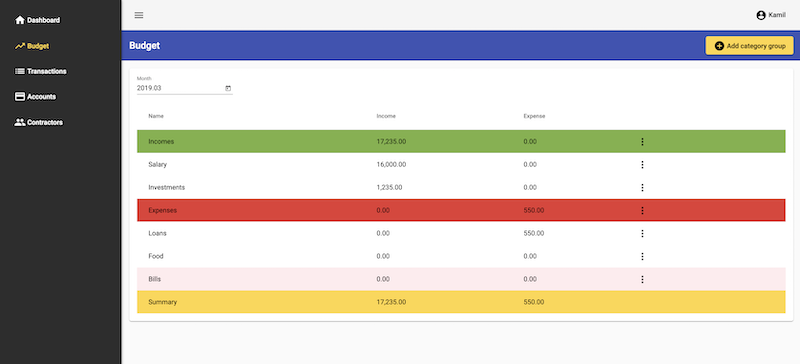

# Home budgeting - app

## About

This is a front-end of home budgeting app.

## Installation

1. run `git clone https://github.com/kamil-rybczynski/budget-app` command
2. run `npm install` command
3. edit `src/environments/environment.ts` file and set `apiUrl` param which must be url to installed `budget-api` repository
4. run `npm run start` command and open http://localhost:4200 url in web browser

## Roadmap

### 0.3.0

- [ ] Feature: Monthly budget planning
- [ ] Feature: Progress bar of monthly budget plan realisation on budget table
- [ ] Feature: Current month plan realisation on dashboard

### 0.2.0

- [ ] Feature: Statistics for contractors
- [ ] Feature: Statistics for accounts
- [ ] Change dashboard stats to three months comparison
- [ ] Travis CI and Coveralls integration
- [ ] e2e tests for auth
- [ ] unit tests for pages, components and services

### 0.1.0

- [ ] Removing transaction
- [ ] Removing category group
- [ ] Removing category
- [ ] Add modals for delete operations confirmation
- [x] Transactions list filtering by month